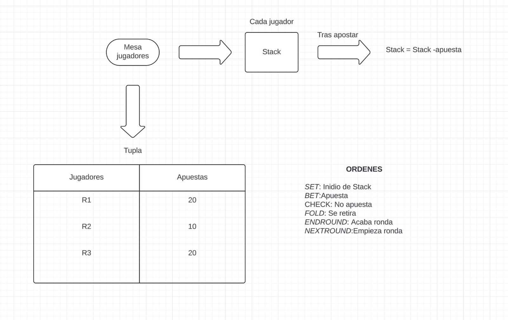

# Texas Hold'em Poker Simulator

## Descripción del Proyecto

Este proyecto es un simulador básico de Texas Hold'em Poker escrito en Python. Está diseñado para gestionar las apuestas, el avance de las rondas y el estado de los jugadores durante un juego de poker. El simulador permite la lectura de instrucciones desde un archivo de texto para automatizar acciones en el juego.

## Estructura del Proyecto

El proyecto consta de una sola clase principal: `TexasHoldemVM`. Esta clase maneja el estado del juego y las acciones de los jugadores.

### Diagrama del Flujo de Juego



### Atributos de la Clase `TexasHoldemVM`

- **stacks**: Lista que contiene la cantidad de fichas de cada jugador. Inicialmente, cada jugador tiene 1000 fichas.
- **pila_apuestas**: Lista que registra las apuestas realizadas en la ronda actual.
- **bote**: Acumula el total de fichas apostadas en todas las rondas.
- **ciega_grande** y **ciega_pequena**: Valores de las apuestas obligatorias de la ciega grande y ciega pequeña.
- **turno**: Índice del jugador que tiene el turno de actuar.
- **jugadores**: Diccionario que mapea los índices de los jugadores a sus identificadores (P1, P2, etc.).
- **ronda**: Fase actual del juego (0: Preflop, 1: Flop, 2: Turn, 3: River).
- **ronda_completada**: Indica si la ronda actual ha sido completada.

### Métodos de la Clase `TexasHoldemVM`

#### `__init__(self)`

Constructor que inicializa los atributos con valores predeterminados.

```python
def __init__(self):
    self.stacks = [1000] * 6  # 6 jugadores con 1000 fichas iniciales.
    self.pila_apuestas = []  # Pila de apuestas.
    self.bote = 0  # El bote comienza en 0.
    self.ciega_grande = 20  # Valor inicial de la ciega grande.
    self.ciega_pequena = 10  # Valor inicial de la ciega pequeña.
    self.turno = 0  # Índice del jugador que tiene el turno.
    self.jugadores = {0: "P1", 1: "P2", 2: "P3", 3: "P4", 4: "P5", 5: "P6"}  # Diccionario de jugadores.
    self.ronda = 0  # Ronda actual (0: Preflop, 1: Flop, 2: Turn, 3: River).
    self.ronda_completada = False  # Indica si la ronda actual ha sido completada.
```
## Comandos del archivo de instrucciones

- `SET R<i> <cantidad>`: Establece el stack del jugador `i` con la cantidad especificada.
- `SET SB <cantidad>`: Establece el valor de la ciega pequeña.
- `SET BB <cantidad>`: Establece el valor de la ciega grande.
- `BET R<i> <cantidad>`: El jugador `i` realiza una apuesta con la cantidad especificada.
- `CHECK R<i>`: El jugador `i` hace check (pasa sin apostar).
- `FOLD R<i>`: El jugador `i` se retira (fold).
- `ENDROUND`: Finaliza la ronda y mueve las apuestas al bote.
- `NEXTROUND`: Avanza a la siguiente ronda si la actual está completada.

## Ejemplo de archivo de instrucciones (`ronda.txt`)

```txt
# Configurar stacks iniciales
SET R0 1000
SET R1 1000
SET R2 1000

# Configurar ciegas
SET SB 10
SET BB 20

# Jugadores apuestan
BET R0 20
BET R1 50
CHECK R2

# Finalizar ronda
ENDROUND

# Avanzar a la siguiente ronda
NEXTROUND
